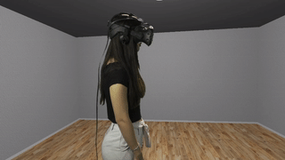
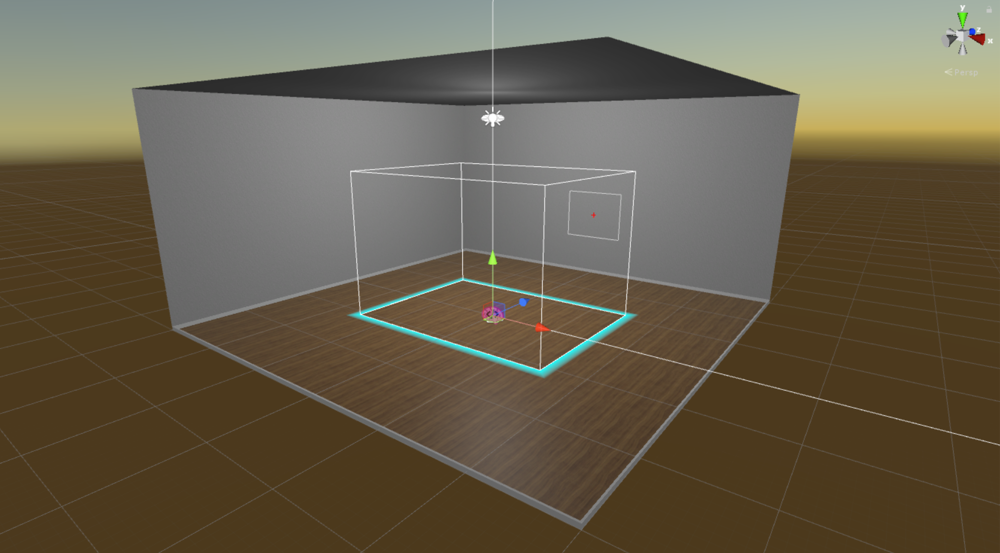
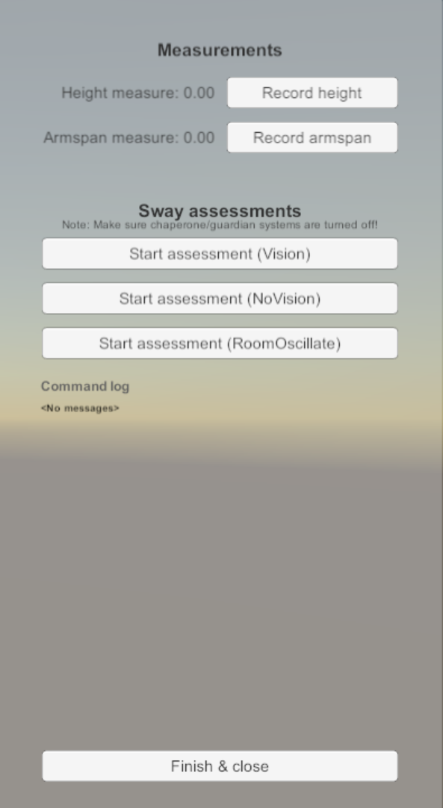
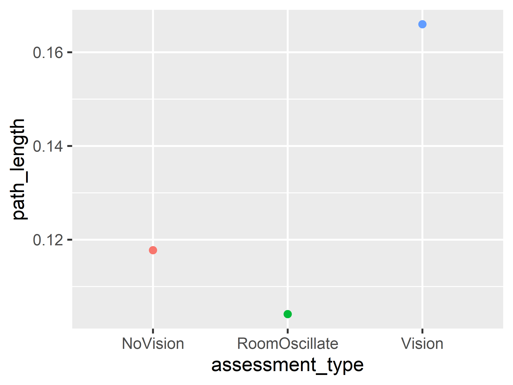

<p align="center">
  
</p>

# Posture Assessment VR

Tool for assessing postural stability/balance/sway in Virtual Reality.

<p align="center">
  
  
  <i>The oscillating room condition</i>
</p>

## Features

Assess posture in one of three conditions.
* Normal (vision).
* No vision (HMD goes dark, ask participant to close their eyes too).
* Oscillating room. Room pitch rotation oscillates at a amplitude and period that you specify.

<p align="center">
  
  
  <i>The virtual room used for the assessments</i>
</p>

## How to use

This is the repository for the Unity project source code; clone/fork and edit as necessary in Unity version `2018.1.X`. If you just want to download and run the assessment, see below.

First download the latest [Release Build](https://github.com/immersivecognition/posture-assessment-vr/releases/tag/2) and extract the zip file to your Windows PC.

1. Make sure you have a SteamVR compatible headset set up on your PC.
2. Put participant in a headset standing in the center of your VR area.
3. Launch the SwayAssessment .exe
4. Create a new participant list (or select existing) - data will be stored next to wherever you put this list.
5. Enter the participant details.
6. From here you can perform measurements:
    * If you want height/armspan measures, ask participant to stand with controllers in hands, hold them out horizontally.
    * Click the buttons to record height/armspan. Height and armspan will be added to the participant's row in the participant list.
    * Click buttons on-screen to perform the various assessments as needed.

<p align="center">
  
  
  <i>The experimenter's user interface</i>
</p>

Info:

This project is built with SteamVR. It should work with any SteamVR compatible headset and SteamVR installed.
You can change some parameters by modifying the file: `posture-assessment-vr_Data/StreamingAssets/psat-vr.json`.
Data output is just raw movement data. Calculate path length by summing the point-to-point distances observed in head movement.

## Example R processing script

Here is a commented example of an R script (written in [Tidyverse](https://www.tidyverse.org/) style) that will process the data from this task, calculating the path length (a measure of stability - lower is better).

```r
library(tidyverse)

# our data is stored in a folder called `data`.
# within the `data` folder is our experiment folder (i.e. `psat-vr` by default).
# within that, is each participant folder.
# within those, is the session folder for each participant.

# first, we load all the trial_results files.
# we do this by recursively searching all files that match a pattern.
# then reading all the files we find (with `map`) and binding them row-wise (`_dfr`)

posture_trials <- list.files(
  path = "data",
  pattern = "trial_results.csv",
  full.names = TRUE,
  recursive = TRUE
  ) %>%
  map_dfr(read_csv)
  
# output (in my case there is only one session)

# A tibble: 3 x 11
#   directory experiment ppid  session_num trial_num block_num trial_num_in_bl~ start_time end_time assessment_type
#   <chr>     <chr>      <chr>       <dbl>     <dbl>     <dbl>            <dbl>      <dbl>    <dbl> <chr>          
# 1 psat-vr-~ psat-vr-1~ P_19~           1         1         1                1       37.0     47.0 Vision         
# 2 psat-vr-~ psat-vr-1~ P_19~           1         2         1                2       55.4     65.4 NoVision       
# 3 psat-vr-~ psat-vr-1~ P_19~           1         3         1                3       73.3     83.3 RoomOscillate  
# ... with 1 more variable: center_eye_movement_filename <chr>

# now we want the head movement data for every trial.
# we can do this by reading each filename given in the `*_movement_filename` column.
# then we can use `unnest` to give 1 row per timestep. 

posture_movement <- posture_trials %>% 
  mutate(center_eye_movement = map(file.path("data", directory, center_eye_movement_filename), read_csv)) %>% 
  unnest()

# output (notice many more rows, and the `pos_*` columns)

# # A tibble: 2,310 x 18
#    directory experiment ppid  session_num trial_num block_num trial_num_in_bl~ start_time end_time assessment_type
#    <chr>     <chr>      <chr>       <dbl>     <dbl>     <dbl>            <dbl>      <dbl>    <dbl> <chr>          
#  1 psat-vr-~ psat-vr-1~ P_19~           1         1         1                1       37.0     47.0 Vision         
#  2 psat-vr-~ psat-vr-1~ P_19~           1         1         1                1       37.0     47.0 Vision         
#  3 psat-vr-~ psat-vr-1~ P_19~           1         1         1                1       37.0     47.0 Vision         
#  4 psat-vr-~ psat-vr-1~ P_19~           1         1         1                1       37.0     47.0 Vision         
#  5 psat-vr-~ psat-vr-1~ P_19~           1         1         1                1       37.0     47.0 Vision         
#  6 psat-vr-~ psat-vr-1~ P_19~           1         1         1                1       37.0     47.0 Vision         
#  7 psat-vr-~ psat-vr-1~ P_19~           1         1         1                1       37.0     47.0 Vision         
#  8 psat-vr-~ psat-vr-1~ P_19~           1         1         1                1       37.0     47.0 Vision         
#  9 psat-vr-~ psat-vr-1~ P_19~           1         1         1                1       37.0     47.0 Vision         
# 10 psat-vr-~ psat-vr-1~ P_19~           1         1         1                1       37.0     47.0 Vision         
# # ... with 2,300 more rows, and 8 more variables: center_eye_movement_filename <chr>, time <dbl>, pos_x <dbl>,
# #   pos_y <dbl>, pos_z <dbl>, rot_x <dbl>, rot_y <dbl>, rot_z <dbl>

# we can now write a function which calculates path length and summarise by it.
# grouping will give us 1 row per trial again

calculate_path_length <- function(x, y, z) {
  # calculates sum of point-to-point distances.
  sum(
    (diff(x) ^ 2 +
     diff(y) ^ 2 +
     diff(z) ^ 2) ^ 0.5
    )
}

posture_summary <- posture_movement %>% 
  group_by(experiment, ppid, session_num, trial_num, assessment_type) %>% 
  summarise(path_length = calculate_path_length(pos_x, pos_y, pos_z))

# output (my data are just of 1 participant, 1 session)

# # A tibble: 3 x 6
# # Groups:   experiment, ppid, session_num, trial_num [3]
#   experiment  ppid           session_num trial_num assessment_type path_length
#   <chr>       <chr>                <dbl>     <dbl> <chr>                 <dbl>
# 1 psat-vr-10s P_190905151224           1         1 Vision                0.166
# 2 psat-vr-10s P_190905151224           1         2 NoVision              0.118
# 3 psat-vr-10s P_190905151224           1         3 RoomOscillate         0.104

# we can plot these data on a graph

ggplot(posture_summary, aes(x = assessment_type, y = path_length, color = assessment_type)) + 
  geom_point()
```

<p align="center">
  
</p>

This is just example data, don't pay attention to the pattern.
